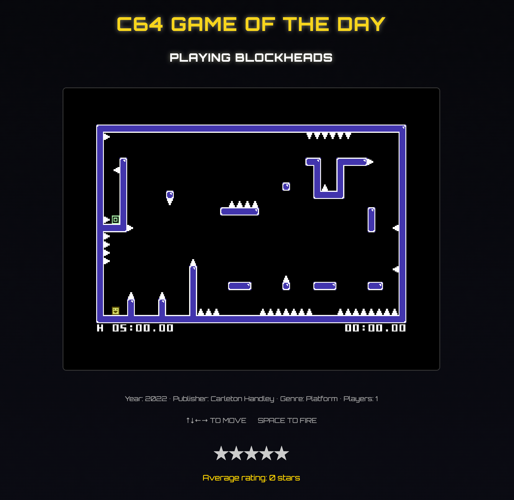

# C64 Game of the Day

A web application that selects a different Commodore 64 game every day allowing users to play it in their browser and rate it.

## Demo Video

<p align="center">
  <video controls width="90%" style="max-width:700px; border-radius:10px; box-shadow:0 2px 16px #000a;">
    <source src="c64gotd-v1-example.mp4" type="video/mp4">
    
    Your browser does not support the video tag.
  </video>
</p>

## Usage

- Ensure hardware acceleration is enabled in your browser
- Browse to http://localhost:3000
- Click "START GAME" to start the game
- Rate the game


## Deployment Overview

- **Production:** Deploys to AWS using CloudFront (for static frontend) and ECS (for backend API/services). S3 is used for game asset storage and CloudFront distribution.
- **Local Development:** Uses Docker Compose for all services, with LocalStack emulating AWS S3 for local game asset storage. The frontend and backend run in containers for a consistent local environment.
- **Game ROMs:** Game files are **not provided** in this repository. You must supply your own C64 game ROMs to use the application.


## Features

- Play C64 games directly in your browser
- Responsive design that works on desktop and mobile
- Touch controls with virtual joystick (to be fixed)
- Keyboard support for desktop users
- Clean, modern UI with dark theme

## Prerequisites

- Node.js 16.8 or later
- npm or yarn
- Docker and Docker Compose

## Getting Started

### 1. Clone the repository

### 2. Add game ROMs

- **Local development:** 
 - Place ROMs in the `games/` directory at the project root. 
    - These will be uploaded to the local S3 bucket in LocalStack on startup.
 - Add to games_data.py
 - Delete games.db
 - Rebuild docker image
- **Production:** Upload ROMs to your configured AWS S3 bucket as required by your deployment assuming the steps for local development were followed.

---

## Running Locally (Frontend & Backend)

### Install frontend dependencies
```bash
cd frontend
npm install
```

### Start the frontend (Vite)
```bash
# for frontend only development with hot reload 
npm run dev
```

- Open your browser at [http://localhost:3000](http://localhost:3000)

### Start the backend (FastAPI)
```bash
cd backend
uv pip install -r pyproject.toml
uvicorn main:app --reload
```

- Backend runs at [http://localhost:8000](http://localhost:8000)

---

## Running with Docker Compose

This project is set up for easy containerized development and deployment.

### Build and start all services
```bash
// Development
docker-compose -f docker-compose.yml -f docker-compose.dev.yml up --build
// Production
docker-compose -f docker-compose.yml -f docker-compose.prod.yml up --build
```
- Frontend: [http://localhost:3000](http://localhost:3000)
- Backend: [http://localhost:8000](http://localhost:8000)

### Stop all services
```bash
docker-compose down
```

---

## Architecture
- **Frontend:** Vite (TypeScript), served via AWS CloudFront (with Route53 for DNS)
- **Backend:** FastAPI (Python 3.13, Pydantic, SQLite, uvicorn), routed via AWS Application Load Balancer (ALB)
- **Backend:** FastAPI (Python 3.13, Pydantic, SQLite, uvicorn)
- **Development:** Hot reload for both frontend and backend, with Docker Compose orchestrating all services and LocalStack emulating AWS S3.
- **Production:** Deploys to AWS CloudFront (frontend), ECS (backend), and S3 (game assets).

---

## Testing

### Frontend
```bash
docker-compose -f docker-compose.yml -f docker-compose.dev.yml run test-frontend
```

### Backend
```bash
docker-compose -f docker-compose.yml -f docker-compose.dev.yml run test-backend
```

---

## License

This project is licensed under the MIT License - see the [LICENSE](LICENSE) file for details.

## Acknowledgments

- [VICE](https://vice-emu.sourceforge.io/) - The Versatile Commodore Emulator
- [Tailwind CSS](https://tailwindcss.com/) - A utility-first CSS framework
- [EmulatorJS](https://github.com/EmulatorJS/EmulatorJS) - A JavaScript emulation platform
